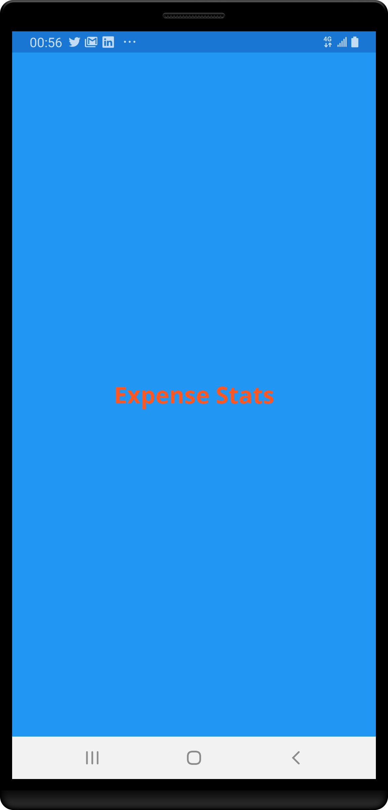
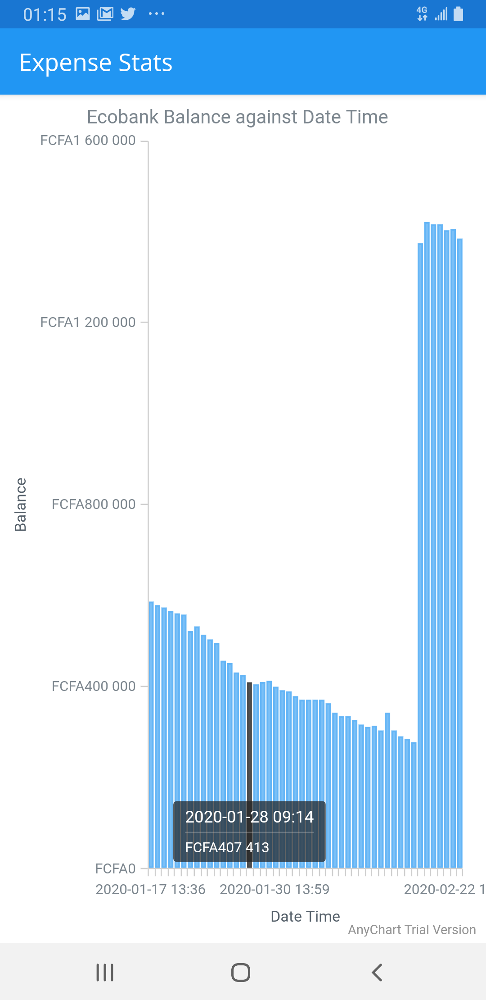

## Expense Stats
Expense Stats is an Android app built with the aim of getting SMS sent by various banks and Mobile
Money operators in Cameroon. 

## What the App does currently
At the moment, the implementation of the app is such that it gets all SMS sent by Ecobank Cameroon to an Ecobank
customer and filters all messages that have the user's current balance and plots a chat of the users balance against date and time.
With this, the user can visualize how their balance fluctuates over time

Presently, here is how the app main app screens look

