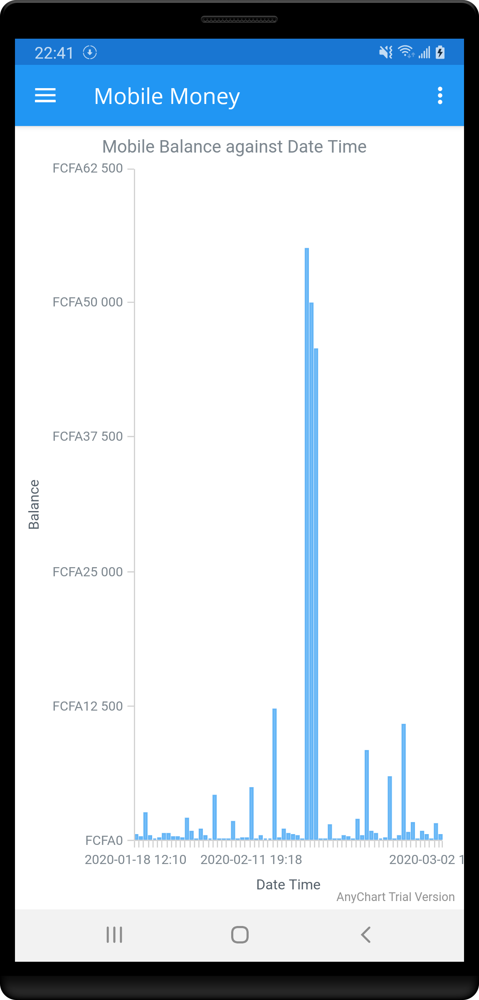
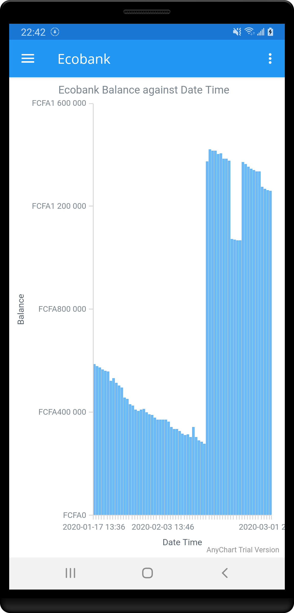
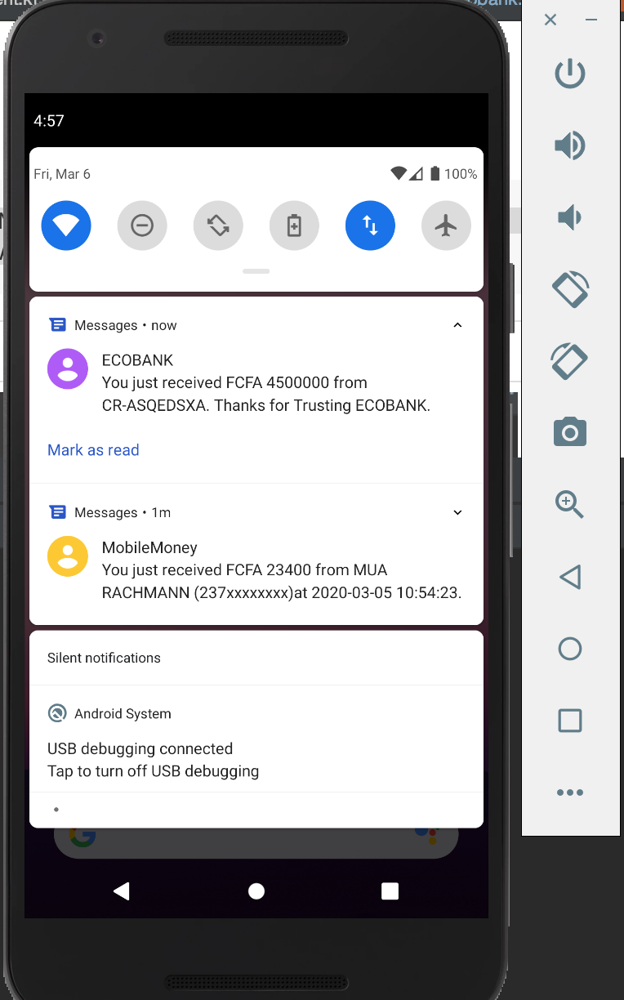
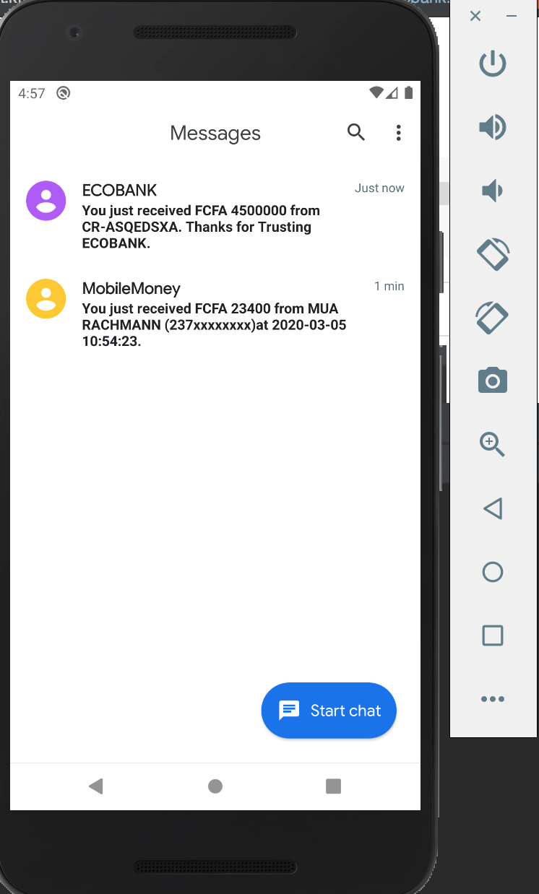

## Expense Stats
Expense Stats is an Android app built with the aim of getting SMS sent by various banks and Mobile
Money operators in Cameroon. 

## What the App does currently
At the moment, the implementation of the app is such that it gets all SMS sent by Ecobank Cameroon to an Ecobank
customer and filters all messages that have the user's current balance and plots a chat of the users balance against date and time.
With this, the user can visualize how their balance fluctuates over time

Presently, here is how the app main app screens look

Splash Screen             |  Mobile Money Screen         | Ecobank Screen
:-------------------------:|:-------------------------:|:---------------------------:
  |  | 

## Stack
The app is written entirely in Kotlin and uses [AnyChart Android](https://github.com/AnyChart/AnyChart-Android) for plotting the graph.

## Work in Progress
The app is a work in progress and the next feature is observing the pattern of MTN Mobile Money messages and getting the balances at each instance and plotting. Same will be done for Orange Money and other banks.
Just create a pull request if you want to contribute to the work or want a feature to be added.

## Testing with Device OR Emulator

Run and build the project. Ensure that you have previous messages from Mtn Mobile Money, Ecobank etc Usually denoted by the title
MobileMoney, ECOBANK, etc. Launch the app and hopefully you should have the screen as above

#### Emulator
To simulate SMS entries with an emulator, use the [Emulator commands](https://developer.android.com/studio/run/emulator-console) to send sample messages
to your emulator as though it was from ECOBANK, Mtn Mobile money etc.

- Open a terminal in the root of your project. This can be achieved by clicking on the terminal tab on android studio
- Type in the following `telnet localhost 5554` depending on your emulator open ports are usually **5554** & **5585**. You should
authenticate using the auth token stored usually in ``/Users/me/.emulator_console_auth_token` you will be prompted for this
- Authenticate using the token e.g `auth &q3edf2f?.s`
- Send a sample message by MobileMoney e.g
```
sms send MobileMoney You just received FCFA 23400 from MUA RACHMANN (237xxxxxxxx)at 2020-03-05 10:54:23.
Transaction ID: 12334231231. Reference: E New account balance: FCFA 45400.
```
Emulator Screen (SMS Notification) |  Emulator Chat Messages
:-------------------------:|:-------------------------:
 | 